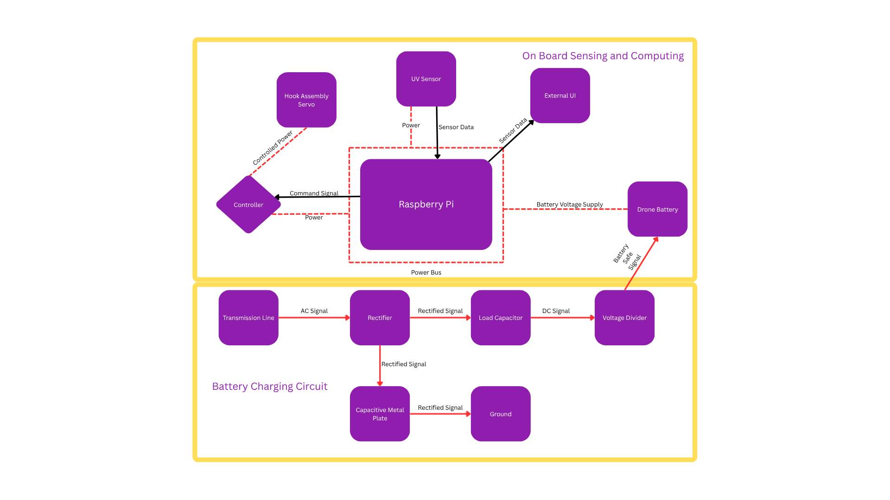
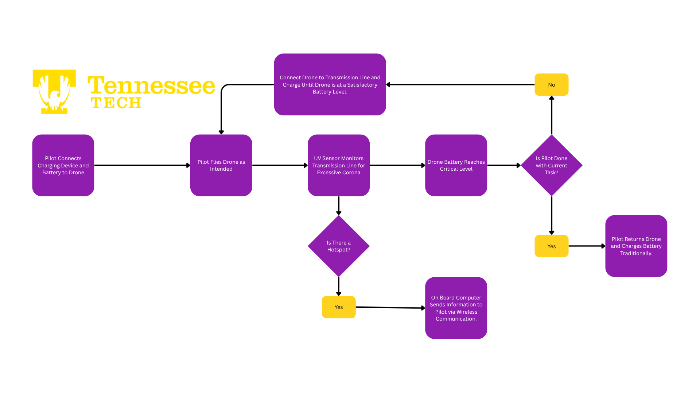

# ArcAngel Power Line Inspection Drone

### Matthew Henderson, Brady Goodman, Grant Christy, Daniel Attih, Lawson Stricklin

Department of Electrical and Computer Engineering

Tennessee Technological University

mghenderso43@tntech.edu, brgoodman42@tntech.edu, gbchristy42@tntech.edu, dattih42@tntech.edu, lwstrickli42@tntech.edu

## Introduction
Electrical power infrastructure is a cornerstone of modern society, yet it remains vulnerable to damage from storms, environmental stress, and equipment aging. Traditional inspection methods for high-voltage power lines, such as bucket trucks, helicopters, and personnel climbing utility poles, continue to pose safety risks, incur high operational costs, and exhibit limited efficiency [1]. These challenges necessitate the development of innovative solutions to enhance the safety, cost-effectiveness, and efficiency of power line inspections.

The ArcAngel Drone project aims to address these challenges by developing a semi-autonomous aerial system capable of operating near high-voltage power lines to identify potential faults. Unlike existing solutions that are limited by flight time and require constant operator control, ArcAngel Drone will feature live-line charging capabilities, enabling extended missions without the need for frequent returns to base for recharging [2], [3]. This capability will facilitate rapid post-storm response and reduce downtime for electric grids. Future iterations of the ArcAngel Drone will incorporate corona detection sensors to identify insulation failures and other anomalies, further enhancing the system's diagnostic capabilities [4], [5], [6].

The primary stakeholders for this project include Joe Wheeler Electric Membership Corporation (JWEMC), which has expressed a need for a drone system capable of in-field recharging to improve inspection efficiency and reduce operational downtime. The project team will be responsible for the design, implementation, and validation of the ArcAngel Drone, ensuring that it meets the specified requirements and addresses the identified challenges.

## Restating the Problem
Utility providers, such as Joe Wheeler Electric Membership Corporation (JWEMC), face significant challenges in maintaining and inspecting high-voltage power lines, particularly after storms or other disruptive events. Traditional inspection methods are often time-consuming and hazardous, requiring personnel to access difficult-to-reach areas [1]. Additionally, the limited flight endurance of current drone systems necessitates frequent returns to base for recharging, further delaying inspections and prolonging power outages [2], [3].

The ArcAngel Drone project seeks to develop a solution to these challenges by creating a semi-autonomous drone capable of recharging directly from high-voltage power lines using a single-wire energy transfer system [2], [3]. This capability will allow the drone to remain operational for extended periods, reducing the need for frequent recharging and enabling more efficient inspections. The system will also include features to ensure safe operation near energized conductors, such as maintaining a minimum clearance distance to prevent arcing and incorporating safety protocols to handle potential system failures [2].

By addressing these challenges, the ArcAngel Drone aims to provide utility providers with a reliable, efficient, and safe tool for power line inspections, ultimately improving grid reliability and reducing operational costs [4], [5], [6].

## Comparative Analysis of Potential Solutions

### Potential Solutions for Power Line Charging

Half Wave Rectifier:
Due to the charging capabilities of the drone attachment, a half wave rectifier to assist in current displacement through the load and into our capacitor plate was considered. Half wave rectifiers are lighter in weight and cheaper overall. Maximum payload for drones is not very high so all types of circuit conditions need to be considered for the operation. The simple design may be needed for payload and an additional non-critical application of half-wave rectifiers could be essential for our charging mount.

Full Wave Rectifier:
A full wave rectifier was also considered for the load charging capabilities it produces. The full-wave rectifier converts both haves of the AC waveform into a DC output, this could be implemented as a bridge rectifier with four diodes. This full wave rectifier gives a lower ripple and better power delivery for the same peak voltage. This improves efficiency and reduces stress on the energy storage with time. Although it seems like the perfect fit, weight is still a major factor in decision making procedures.

Capacitor Load:
Using a capacitor stores energy delivered by the rectifier and will supply short bursts to the downstream internal drone battery. Rectified AC will charge the capacitor, then the capacitor will displace current to the downstream battery when needed. A capacitor load is considered for its smooth output and high instantaneous power at output. Capacitors are very hefty though, using a capacitor really negates how much payload a drone could carry, a DC-DC converter will also be needed because the capacitor falls linearly at discharge.

Battery Load:
Using the internal batteries as the primary energy sink on the mounting device to trickle charge the drone is also considered. The rectifier is designed to safely charge the battery which will provide regulated and dense energy storage for the drone. Charging these internal batteries could be an issue due to safety risks and could need temperature monitoring. A battery management system will need to be implemented as well.

### Potential Solutions for Corona Detection and Camera Sensing

Infrared/Thermal Imaging:
A potential solution for detecting excess corona can be solved with an IR camera which generates localized heating to do ionization and current leaking. Infrared and thermal imaging can detect heat signatures to pinpoint areas of excess thermal signatures or arcing. IR detects emitted infrared radiation hotspots, which will allow for identification of stressed components. These cameras can also monitor overloaded connections and mechanical stress. These are affected by temperature and wind and will need extensive calibration strategies to distinguish excess corona from other thermal sources.

Ultraviolet Imaging Sensors:
Corona discharge emits energy mostly in the ultraviolet spectrum, making UV imaging one of the most reliable methods. These specialized cameras detect UV photons from ionized air near high-voltage conductors in daylight conditions. UV sensors capture short-wavelength emissions, invisible to the naked eye, to identify intensity and location of strongly correlated corona activity. They do need shielding from sunlight to prevent false positives and can be relatively expensive.

Optical/Visual Spectrum Cameras (RGB/Multispectral):
High resolution RGB or multispectral cameras will be useful in providing confirmation of physical damage, arcing, and surface degradation. Image processing and machine learning algorithms can also detect characteristic color changes, carbon tracking, and visible arcing patterns to assist in areas where excess corona could occur. These are readily available at a low cost with very lightweight camera modules. It cannot directly see corona discharge and may be affected by glare.

Depth/Stereo Cameras:
With many drones having their own attached camera, a stereo or structured light camera can compute depth by comparing two or more visual perspectives. These could provide depth maps for autonomous navigation and terrain avoidance which are beneficial for identifying tower geometry and wire positioning. These cameras can be potentially power straining and are sensitive to sunlight interference.

### Potential Solutions for Communication and Computing

Raspberry Pi Zero:
The original Raspberry Pi Zero is a very minimalist, single core computer designed for very low power embedded applications. It does require external Wi-Fi or Bluetooth dongles for communication. The power draw and weight are extremely low compared to other solutions but comparable to the Raspberry Pi Zero 2 W. It will be good for monitoring charging status and battery voltage and current and forwarding periodic GPS position data. It only operates with a single CPU core with 512 MB of RAM, so it cannot handle multitask heavy computations and extreme camera based processing.

Raspberry Pi Zero 2 W:
The updated Raspberry Pi Zero 2 W provides an updated performance over the original Zero while maintaining a very similar size and weight profile. It features a 1 GHz processor with a 512 MB RAM and built in Wi-Fi and Bluetooth capabilities. This provides onboard computations and wireless communication capabilities without external connection. The extra processing allows for reading voltage/current sensors and logging GPS data through a ground Wi-Fi station. It also has the ability to run lightweight image recognition.

Texas Instruments INA3221:
The TI is a triple channel, high side current and bus voltage monitor made to measure voltage and current across up to three separate power rails. The design can be implemented to have Channel One monitor the battery, Channel 2 monitor the charging current, and Channel Three monitoring the payload. It communicates over the I^2C bus which allows easy communication with the Raspberry Pi for real time updates. The issue occurs with voltages over 26 V where it can no longer measure and requires very precise shunt resistors.

ADS1115 + Discrete Shunt Amplifiers:
The ADS1115 is a 16-bit, low power analog to digital converter that communicates with I^2C and provides up to four input channels. Each channel can be connected across a shunt resistor placed in current paths and amplified which will then be fed to the Raspberry Pi. It has very low power consumption and flexible gain and channel configuration. It has no maximum voltage measurement as well. It does need extra components and is most susceptible to noise.

u-blox ZED-F9F:
The ZED-F9F is a high precision dual-band, multi-constellation receiver designed for advanced GPS applications. It has four satellite connections leading to accurate location finding within one meter. It can output velocity and heaving with low latency, using up to 30 Hz update rates. It draws around 50-70 mA and also uses I^2C communication. It uses Real-Time Kinematic which is ideal for real time updates of drone location and while using this setting location can be found at approximately 1 cm.

### Potential Solutions for Battery and BMS

Lithium-Ion Battery Pack:
The Lithium-Ion Battery Pack is the most common choice for drones and portable power. It has high energy density, lightweight construction and stable voltage characteristics. A Li-Ion pack configured as a 4S or 6S, which is 14.8V-22.2V nominal, provides a suitable balance of energy storage and weight. When integrated with proper current limiting and BMS protection, it offers long term service of around 500-1000 cycles.

Lithium-Polymer Battery Pack:
The Lithium-Polymer Battery is a subtype of Li-Ion chemistry using a polymer electrolyte which offers higher discharging rates and very light packaging. These are often used in UAVs where high current draw and rapid power responses are required. An Li-Po configuration can deliver high current outage while remaining lightweight but must be paired with a robust BMS to avoid over discharge and contain a shorter lifespan of around 200-300 cycles.

Texas Instruments BQ76930:
For a Battery Management System (BMS) the formerly listed ADS1115 and INA3221 will do more than suffice but a third option could be BQ76930. It provides essential monitoring and protection features: cell voltage measurement, overcurrent protection and cell balancing. It also communicates with I^2C, making it compatible with the Raspberry Pi. It lacks digital configuration customization and is not built with Coulomb counting.

### Potential Solutions for Mechanical and Structural Subsystems

LW-PLA For 3D Printing:
The LW-PLA filament is a foaming thermoplastic material that has a low-density internal structure without requiring a hollow infill. When heated to approximately 220-250 C, the polymer foams resulting in a weight reduction of 30-50% compared to standard PLA, this is crucial for low weight operations. It is easy to print on common FDM printers. It will be most commonly used on areas where high mechanical strength is not required and is sensitive to heat and UV exposure.

PA12 for 3D Printing:
Polyamide-12 is a professional grade material printed using Selective Laser Sintering. It is very common for lightweight structural parts due to it’s excellent mechanical properties, impact resistance, and low moisture absorption. SLS printing does not require support structures which make hollow internal geometries and highly optimized that are both strong and extremely light. This is ideal for mounts, arms, and moving parts where rigidity and weight efficiency are required. It does need outsourced printing and post processing which lead to longer lead times.

Telescoping Extension for Line Connecting Hook:
A telescoping extension uses nested tubes or rails that slide linearly to extend reach. It’s compacted form at rest and longer reach when opened is useful for latching onto a power line from a safer standoff. Nested sections with a round or rectangular profile slide out in sequence by a passive or active drive mechanism that push sections to extend and retract. It has a possibility to have minor sealing and debris issues and could potentially be flexible if extended too thin, vibration from the line and weather conditions must be considered.

Linear Axis Arm for Line Connection Hook:
A linear axis arm uses a rotating axle to convert rotary motion into a linear motion to extend a rigid arm. This will use either a motor or piston to drive the arm up to connect to the line and then let it lay down after disconnection. These decreases moving part counts and is not affected by debris or weather. It is much more accurate and easier to control precisely with less failure points but could increase weight of the mechanism and the stowed volume is unchanged.

## High-Level Solution

The integrated system is a drone-mounted inspection and charging module engineered to safely harvest energy from live transmission lines, detect corona discharge activity, and provide synchronized data communication for power line monitoring applications. The system is organized into five atomic subsystems—Power Harvesting & Charging, Corona Detection & Camera Sensing, Control/Compute & Communication, Battery & BMS, and Mechanical & Structural—each tailored to fulfill a distinct set of functional, safety, and performance requirements. The Power Harvesting & Charging Subsystem uses a full-wave rectifier with a capacitor load to efficiently convert AC power from the line into stable DC voltage for onboard use. The Corona Detection & Camera Sensing Subsystem employs a UV sensor for identifying corona discharges and a visual camera for contextual image capture, ensuring accurate detection and verification of electrical activity. The Control/Compute & Communication Subsystem, built around a Raspberry Pi Zero 2W and a u-blox ZED-F9F GNSS module, manages system logic, data fusion, and wireless telemetry while maintaining precise timing and location synchronization. The Battery & BMS Subsystem utilizes a voltage divider network and an AOSIII5-based controller to monitor, protect, and regulate power delivery throughout the system. Finally, the Mechanical & Structural Subsystem, fabricated from LW-PLA and featuring a linear-axis arm for line connection, provides lightweight durability, mechanical stability, and safe electrical insulation. Together, these subsystems form a cohesive, modular architecture that optimizes energy efficiency, detection reliability, and structural integrity while minimizing weight, power consumption, and operational risk. 

### Hardware Block Diagram

### Operational Flow Chart

## Atomic Subsystem Specifications

### Power Harvesting & Charging Subsystem
#### Description
The Power Harvesting & Charging Subsystem converts high-voltage AC from the transmission line into a regulated DC supply using a full-wave rectifier circuit. The rectified output charges a capacitor load, which stabilizes the DC voltage before it is transferred to the Battery & BMS Subsystem. This arrangement minimizes output ripple and provides efficient power conversion with high energy transfer reliability.
#### Interfaces
- Signal Type: Power (AC input, DC output)
- Direction: AC input from line (input), DC output to BMS (output)
- Protocol: Analog voltage and current sense via I²C to the compute unit
- Data: Voltage/current readings, charge enable/disable commands
#### Operation
1. Detect line contact through the mechanical coupling signal.
2. Enable the rectifier circuit and begin charging the capacitor load.
3. Monitor voltage and current; transfer stabilized DC to BMS.
4. Disable charging upon reaching the threshold or detecting a fault.
#### Shall Statements
- The subsystem shall rectify high-voltage AC using a full-wave rectifier and output regulated DC.
- It shall charge a capacitor load to buffer transient power fluctuations.
- It shall include overvoltage and surge protection elements.
- It shall communicate charge status and fault conditions to the compute subsystem via I²C.
- It shall safely isolate the HV input to comply with insulation and creepage standards.

### Corona Detection & Camera Sensing Subsystem
#### Description
This subsystem detects and verifies corona discharges using a UV sensor for emission detection and an optical/visual camera for high-resolution image capture. The UV sensor monitors ultraviolet radiation signatures associated with partial discharges, while the camera provides corresponding visual context for each event. The data is processed and timestamped by the compute subsystem to confirm and classify detected corona activity.
#### Interfaces
- Signal Type: Digital (I²C or SPI for UV sensor data), Video stream (CSI/USB for camera)
- Direction: Output (sensor → compute/control and communication subsystem)
- Protocol: I²C for sensor telemetry, MIPI-CSI for camera data
- Data: UV intensity readings, image frames, and timestamped detection events
#### Operation
1. Initialize the UV sensor and camera.
2. Continuously monitor UV intensity and trigger on threshold exceedance.
3. Capture a visual image and send both data sets to the compute unit.
4. Log and transmit the combined event package for analysis or storage.
#### Shall Statements
- The subsystem shall detect corona discharge events via UV emissions.
- It shall capture visual imagery synchronized with each detected event.
- It shall timestamp and transmit data to the compute unit.
- It shall provide adjustable sensitivity thresholds via I²C configuration.
- It shall operate within environmental limits defined by the structural subsystem.

### Control/Compute & Communication Subsystem
#### Description
The Control/Compute & Communication Subsystem is built around a Raspberry Pi Zero 2W and a u-blox ZED-F9F GNSS module. It coordinates data acquisition, manages subsystem communication, and controls charging logic. The Raspberry Pi processes UV and camera data, manages battery telemetry, and communicates with external systems via wireless interfaces. The ZED-F9F module provides precise GPS positioning and time synchronization for event correlation and logging.
#### Interface
- Signal Type: Digital (I²C, UART, SPI, Wi-Fi)
- Direction: Bidirectional (control and telemetry)
- Protocol: I²C to sensors/BMS, UART to GNSS, Wi-Fi to ground station
- Data: Event logs, GPS coordinates, voltage data, control signals
#### Operation
1. Initialize all peripherals at startup.
2. Receive data from sensors, BMS, and the rectifier subsystem.
3. Fuse and timestamp incoming data with GPS synchronization.
4. Control charging enable/disable logic based on BMS feedback.
5. Transmit telemetry and visual data to the operator interface.
#### Shall Statements
- The subsystem shall use a Raspberry Pi Zero 2W for data processing and control.
- It shall interface with the u-blox ZED-F9F GNSS module for precise timing and position data.
- It shall control charging logic via GPIO/I²C.
- It shall store and transmit sensor and event data via Wi-Fi.
- It shall operate within a 6–10 W nominal power range and manage power states for efficiency.

### Battery & BMS Subsystem
#### Description
The Battery & BMS Subsystem manages onboard energy storage, protection, and telemetry. It employs a voltage divider for pack voltage measurement and an AOSIII5 BMS controller to regulate charge/discharge cycles. The BMS protects against overvoltage, undervoltage, and overcurrent conditions, ensuring safe and efficient power delivery to all electronic loads.
#### Interfaces
- Signal Type: Power (DC), Analog telemetry via voltage divider, I²C communication
- Direction: Input (charging), Output (power to compute/sensors)
- Protocol: I²C telemetry and control signals
- Data: Voltage levels, charge status, fault flags
#### Operation
1. Receive DC from the power harvesting subsystem.
2. Measure the pack voltage through the divider network.
3. Regulate charging/discharging through AOSIII5 logic
4. Report the state-of-charge and faults to the compute subsystem.
#### Shall Statements
- The subsystem shall regulate energy flow between the charger and the load.
- It shall use a voltage divider to monitor the pack voltage.
- It shall implement cell protection and balancing through the AOSIII5 BMS controller.
- It shall communicate voltage and status data to the compute subsystem.
- It shall disconnect the pack automatically during fault or overcurrent conditions.
  
### Estimated Power Consumption
| **Subsystem** | **Typical/Nominal (W)** | **Peak (W)** |
|----------------|--------------------------|---------------|
| Power Harvesting and Charging (electronics only) | 3.0 W | 6.0 W |
| Battery and BMS (AOSIII5 and monitoring) | 0.5 W | 2.0 W |
| Sensor and Detection (UV sensor + optical sensor + sensor MCU) | 4.0 W | 6.0 W |
| Control/Compute and Comm (Raspberry Pi Zero 2W + u-blox ZED-F9F) | 4.5 W | 6.0 W |
| Mechanical/Structural (electronics + actuator) | 0.5 W | 25.0 W |
| **Total** | **12.5 W** | **45 W** |

### Mechanical & Structural Subsystem
#### Description
The Mechanical & Structural Subsystem is constructed using LW-PLA filament for lightweight and durable 3D-printed components. It houses all electronic subsystems, maintains balance relative to the drone’s center of gravity, and includes a linear axis arm for line connection via a mechanical hook. The subsystem provides insulation, structural rigidity, and protection from vibration and environmental exposure.
#### Interface
- Signal Type: Mechanical interface, physical mount, and sensor enclosure
- Direction: Physical coupling to the drone and the electrical subsystems
- Protocol: N/A (mechanical system)
- Data: Limit switch feedback (digital signal) for engagement confirmation
#### Operation
1. Mount the subsystem to the drone leg or the designated interface.
2. Deploy the linear arm for line engagement under the compute/control and communication subsystem.
3. Confirm contact via the limit switch and enable charging.
4. Retract the arm after the operation and secure the enclosure.
#### Shall Statements
- The subsystem shall be fabricated from LW-PLA for low weight and rigidity.
- It shall include a linear axis arm for precise line engagement.
- It shall maintain insulation and creepage distances for high-voltage operation.
- It shall provide sealed feedthroughs for wiring and component protection.
- It shall maintain proper CG alignment and pass vibration, shock, and ingress tests.

## Ethical, Professional, and Standards Considerations

The proposed drone system for power line charging and corona detection carries significant implications across culture, society, the environment, public health, safety, and the economy. At its core, the project addresses a critical societal need: maintaining reliable electrical infrastructure while reducing risks to human workers. By shifting inspection and charging tasks from manual crews and helicopters to lightweight autonomous drones, the project enhances public safety. This transition also strengthens public trust in utility providers by ensuring that inspections are performed more frequently, more safely, and with greater precision.

From an environmental perspective, the drone system reduces reliance on fuel-intensive inspection methods, lowering carbon emissions and minimizing the ecological footprint of routine maintenance. The potential use of lightweight materials such as LW‑PLA or PA12, combined with potential efficient energy storage solutions like Li‑Ion or Li‑Po batteries, further reduces energy consumption during flight. 

Public health and safety are central to the project’s mission. By removing workers from high-voltage environments, the risk of electrocution, falls, and other occupational hazards is significantly reduced. The design incorporates safety-critical features such as a Battery Management System (BQ76930) to prevent overcharge, overcurrent, or thermal runaway, and robust mechanical subsystems that can withstand vibration, weather, and debris without failure. These practices ensure that the drone operates reliably in the field without posing risks to bystanders or infrastructure. Indirectly, the project also supports public health by safeguarding the continuity of power delivery, which is essential for hospitals, schools, and emergency services.

Economically, the project offers long-term cost savings by reducing the need for manned inspections and extending the lifespan of power infrastructure through early detection of faults. The modular design approach, which leverages 3D‑printed components for non-critical parts and durable PA12 for structural elements, reduces prototyping and replacement costs. Sensor selection also reflects economic considerations: while ultraviolet cameras provide the most accurate corona detection, they are expensive, so pairing them with lower-cost RGB or multispectral cameras balances precision with affordability. Similarly, Li‑Ion batteries are prioritized for their longer cycle life, reducing replacement frequency compared to Li‑Po packs.

The design process is guided by established standards organizations to ensure compliance, safety, and interoperability. IEEE standards inform the design of rectifiers, communication protocols, and power electronics. IEC standards govern safety requirements for high-voltage equipment and corona detection instrumentation. FAA regulations constrain drone weight, altitude, and autonomous operation, shaping the overall system architecture. UL certification standards for battery safety and ISO guidelines for environmental and quality management further influence material selection, lifecycle planning, and operational practices. Together, these standards ensure that the system is not only technically sound but also safe, sustainable, and legally compliant.

In summary, the broader impacts of this project have directly shaped subsystem choices and design practices. Weight constraints drive the use of lightweight materials and compact electronics; safety requirements necessitate robust BMS integration and sensor calibration; and economic realities guide sensor pairing and modular construction. By aligning with international standards and addressing cultural, societal, environmental, health, safety, and economic impacts, the project delivers a balanced, responsible, and forward-looking solution for power line inspection and charging.

## Resources

### Budget

The total estimated budget for this project is approximately $640, which covers the essential components required to develop a functional prototype of the ArcAngel Drone subsystem assembly for power line inspection and live-line charging. Each item listed below includes a justification linking it to the corresponding subsystem described in the Atomic Subsystem Specifications section. The team minimizes costs by using school-provided equipment and low-cost commercial parts while maintaining technical alignment with subsystem requirements.

| **Item**                          | **Description**                                         | **Estimated Cost**      |
|----------------------------------|---------------------------------------------------------|--------------------------|
| **Mechanical/Structural**         |                                                         |                          |
| Drone Base Platform              | Provided by the school or customer. Serves as the foundation for mounting all subsystems, supporting the Mechanical & Structural Subsystem requirements for weight distribution, vibration tolerance, and balance.                    | Provided  |
| 3D Printing Filament             | Used to fabricate lightweight structural housings, enclosures, and mounts as specified in the Mechanical & Structural Subsystem. LW-PLA reduces weight by up to 50%, satisfying the design’s low payload constraint.               | $75                |
| Power Line Hook Assembly   | Includes conductive hook, insulation, and mounting hardware necessary for safe attachment to transmission lines. Directly supports the Power Harvesting & Charging Subsystem by enabling physical connection for energy transfer while maintaining insulation and clearance standards.| $75|
| **Subtotal**         |                                                                    |  $150              |
| **Power Line Charging**                |             |               |
| Rectifier + Coupling Circuit Components   | Diodes, capacitors, and resistors for AC-DC conversion in the Power Harvesting & Charging Subsystem. These components implement the full-wave rectifier and capacitor load described in subsystem specifications to produce regulated DC for the BMS. | $100      |
| Metal Plate | Acts as the coupling plate between the drone and the high-voltage line, allowing displacement current flow for the charging mechanism described in the Power Harvesting & Charging Subsystem. Provides an isolated charging interface.        | $20                     |
| Voltage Divider | Used to measure and regulate the internal battery voltage as described in the Battery & BMS Subsystem.        | $30                    |
| BMS | Manages charge/discharge cycles, overcurrent, and overvoltage protection per Battery & BMS Subsystem requirements. Ensures safe power regulation and data communication with the compute unit.        | $70                   |
| Drone Battery | Serves as the primary onboard energy storage per the Battery & BMS Subsystem. Provides stable DC output for compute, sensor, and actuator loads during flight and while disconnected from the line.        | $50                   |
| **Subtotal**         |                                                                    |  $270              |
| **Sensing and Communication**           |  |             |
| Raspberry Pi Zero 2 W| Central controller for the Control/Compute & Communication Subsystem. Provides onboard processing, subsystem coordination, and Wi-Fi connectivity for telemetry and data transmission.                     | $15              |
| UV Sensor | Core sensing component of the Corona Detection & Camera Sensing Subsystem. Detects ultraviolet emissions from corona discharge for real-time fault identification.                     | $30              |
| User UI | Software component enabling remote monitoring, live data visualization, and control of system telemetry. Supports Control/Compute & Communication Subsystem by providing operator access to charging and sensor data.    | $25              |
| **Subtotal**         |                                                                    |  $70              |
| Unforseen Expenses | Covers miscellaneous costs (connectors, wiring, leads, safety gear, small hardware replacements). Supports all subsystems for integration and testing.                     | $150             |
| **Project Total**         |                                                                    |  $640            |

### Division of Labor

After evaluating the skills of each team member and the requirements of the project’s subsystems, responsibilities were assigned to align with individual strengths and expertise.

Power Line Charging Subsystem – Matthew Henderson is responsible for developing the high-voltage charging circuitry. His background in circuit analysis and prior experience working with high-voltage systems make him well suited to design and implement the live-line rectifier and coupling components safely and effectively.

Battery Safety and BMS Subsystem – Brady Goodman oversees the design of the battery protection and management system. His skills in circuit analysis and understanding of high-voltage safety complement Matthew’s work, ensuring reliable charging, balancing, and energy regulation for the onboard power system.

Corona Detection and Camera Sensing Subsystem – Lawson Stricklin leads the design of the UV and visual sensing system. He has experience with embedded electronics and camera integration through prior coursework and independent projects, making him capable of implementing the sensor calibration and image capture functions needed for corona detection.
Battery Safety (BMS)

Control/Compute and Communication Subsystem – Daniel Attih is responsible for system coordination, data processing, and wireless communication. As the team’s computer engineering major, Daniel brings expertise in embedded programming, communication protocols, and system integration, ensuring that all subsystems operate together through reliable software control.

This division of labor ensures that each subsystem is led by a team member whose skills and experience align with the technical requirements of their assigned area, promoting efficiency and effective system integration.

### Timeline

The capstone team has one academic year to design and develop a drone housing for power line inspection. The drone will be capable of detecting excessive corona discharge and will also incorporate a system to recharge from the transmission line.

In the first semester, the focus will be on defining the project scope, breaking it into smaller tasks, and beginning the design process.

During the second semester, the team will refine the prototype, finalize parts and specifications, and move into system integration. The final phase includes building, testing, troubleshooting, and validating the completed drone.

If the team follows the schedule outlined in the Gantt chart, the project will result in a fully functional inspection drone by May 2026.

## References

[1] DJI Enterprise, "Powerline Inspection," DJI Enterprise. [Online]. Available: https://enterprise.dji.com/inspection/powerline-inspection. [Accessed: 28-Oct-2025].

[2] Y. Liu, "High-Efficiency Wireless Charging System for UAVs Based on PT Symmetry," SCIEpublish, 2025. [Online]. Available: https://www.sciepublish.com/article/pii/521. [Accessed: 28-Oct-2025].

[3] B. Ben-Moshe et al., "Power Line Charging Mechanism for Drones," MDPI Electronics, vol. 5, no. 4, pp. 108, 2021. [Online]. Available: https://www.mdpi.com/2504-446X/5/4/108. [Accessed: 28-Oct-2025].

[4] "UV Inspection for Corona Detection on High-Voltage Lines via UAV," Drone Division. [Online]. Available: https://dronedivision.be/en/blog/2023/02/09/uv-inspection-for-corona-detection-on-high-voltage-lines-via-uav/. [Accessed: 28-Oct-2025].

[5] "How Power Utilities Detect Corona Discharge with Drones," ABJ Drones. [Online]. Available: https://abjdrones.com/how-power-utilities-detect-corona-discharge-with-drones/. [Accessed: 28-Oct-2025].

[6] "Aerial Power Line Inspection with Corona Camera," Hepta. [Online]. Available: https://www.youtube.com/watch?v=1n2TpImqnlc. [Accessed: 28-Oct-2025].

## Statement of Contributions

Matthew Henderson - Contributed to Resources, including budget and timeline. Created block diagram and flow chart.

Brady Goodman - Contributed to Introduction, Restating the Problem, and revisions.

Grant Christy - Contributed to Comparative Analysis of Solutions and revisions.

Daniel Attih - Contributed to High-Level Solution and Atomic Subsystem Specifications.

Lawson Stricklin - Contributed to Ethical, Professional, and Standards Conciderations. 
