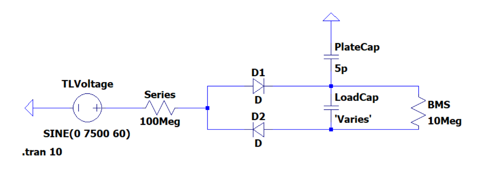
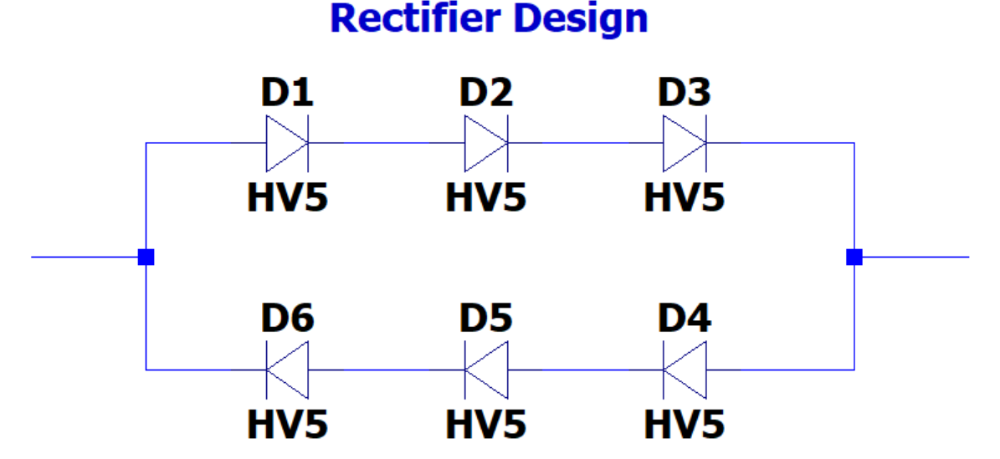
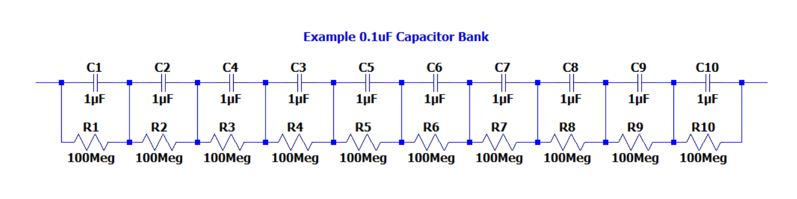
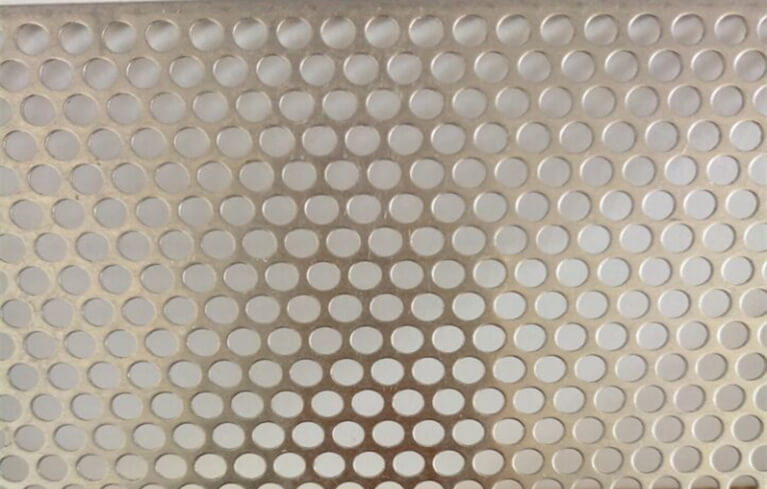

# Power Harvesting & Charging: Detailed Design

## Function of Subsystem

The Power Harvesting & Charging subsystem serves as the electrical energy interface between the drone and the transmission line. Its primary function is to convert the high-voltage AC present on a 13 kV distribution line into a safe, regulated DC supply that can be used by the Battery and BMS subsystem to charge the drone’s onboard battery. This is achieved by harvesting AC energy through a coupling interface, rectifying it using a full-wave rectifier circuit, and stabilizing the output with a load capacitor to minimize ripple and voltage fluctuations before delivery to the BMS.

A secondary function of this subsystem is to provide electrical isolation and protection for all other onboard electronics. It ensures that any high-voltage surges, transients, or faults remain confined within the harvesting circuit, protecting the drone’s compute and sensing systems. Once the DC output is stable and within the required limits, control of charging operations and communication with the onboard computer are managed by the Battery and BMS subsystem.

## Specifications and Constraints

### Specifications

- The subsystem shall safely harvest electrical energy from a 13 kV (phase-to-phase) distribution line, capturing the usable portion of the electric field current through the conductive hook and returning it to ground through the capacitive plate.
- The subsystem shall efficiently deliver conditioned DC power to the Battery Management System (BMS) such that the BMS can regulate, convert, and store the harvested energy without exceeding its input limits.
- The subsystem shall rectify the high-voltage AC signal using a diode-array rectifier designed to withstand at least 7.5 kV phase-to-ground and the expected peak line-to-ground voltage under normal operating conditions.
- The subsystem shall include a load capacitor bank that stores harvested charge and periodically discharges into the BMS subsystem once the capacitor reaches a pre-defined voltage threshold suitable for BMS input and conversion
- The subsystem shall maintain a total mass of ≤ 100 g, including the rectifier, load capacitor array, wiring, coupling plate, insulation, and mechanical mounting, to ensure drone stability and flight performance are not compromised.
- The subsystem shall incorporate electrical isolation, buffering, and physical insulation appropriate for operation in proximity to energized transmission lines, preventing hazardous leakage currents through the drone frame or electronics.

### Constraints

- High-voltage environment: The coupling plate and rectifier must withstand stray electric fields up to tens of kilovolts. Creepage and clearance must follow IEC 60664 spacing requirements [1].
- Capacitive coupling limitations: Plate size is limited by drone weight, meaning the plate’s capacitance to ground cannot exceed practical physical dimensions.
- Operating temperature: Components must function from −10 °C to +50 °C.
- Weather exposure: Though the system is not intended for rain, components must tolerate humidity up to 95% non-condensing.
- Vibration: Subsystem must survive flight vibration and line-contact shock loads.
- The subsystem must not risk unintended conduction into the drone frame or operators, requiring full electrical isolation from user-accessible components.

## Overview of Proposed Solution

The proposed solution for the Power Harvesting and Charging Subsystem is a lightweight, high-voltage-tolerant energy-harvesting module that safely converts the transmission line’s AC signal into a regulated DC power source for the drone’s battery system. The design integrates four primary elements: a high-voltage full-wave diode rectifier, an energy-storage load capacitor, a charge enabling Mosfet acting as a switch, and a capacitive plate that completes the return path to earth. Working together, these components enable reliable power extraction while meeting all subsystem specifications and adhering to weight, safety, environmental, and regulatory constraints defined in the project requirements. All together, these components create this circuit: 

### Full-Wave Rectifier

The rectifier receives the high-voltage AC signal from the transmission line and converts it into a rectified waveform that charges the load capacitor. The rectifier is implemented using two diode arrays arranged in a full-wave configuration, with each array consisting of three high-voltage Diotec HV5 diodes connected in series. Each HV5 diode is rated for 5 kV and 200 mA, and placing three in series provides the necessary voltage withstand capability for safe operation under the expected transmission-line conditions. The resulting configuration creates a robust, buildable high-voltage rectifier suitable for this subsystem [2] [3] [4].

### Load Capacitor

The load capacitor stores the rectified energy coming from the full-wave rectifier and presents a quasi-DC voltage that can be processed by the downstream battery-charging electronics. To keep the design flexible for testing next semester, the load capacitor is implemented as a modular capacitor bank rather than a single fixed component. We will test a range of different capacitances from 0.1 µF to 10 µF using a capacitor bank of series lower voltage capacitors. By installing different combinations of these capacitors in parallel, the effective load-capacitance can be swept from below 1 µF up to several microfarads without changing the layout. For example, one baseline configuration uses ten 0.1 µF, 630 V film capacitors in parallel to realize an effective load capacitance of approximately 1 µF.

A high-value resistor network is placed in parallel with the capacitor bank to provide a defined DC load and a safe discharge path for the stored charge when the drone disconnects from the line. The initial design uses a total bleed resistance on the order of 10–20 MΩ, implemented either as a single resistor or as a series chain, so that the discharge current remains in the microamp range while still discharging the bank on the order of seconds. For optional experiments that use series-connected capacitors to increase voltage rating, each series element will have its own large-value equalization resistor (≈100 MΩ) connected in parallel to ensure that the voltage divides evenly across the stack [5] [6] [7].

 
### Capacitive Plate

The capacitive plate is the primary interface between the drone and the earth reference during power harvesting. When the drone is attached to a 13 kV distribution line, the capacitive plate provides a controlled return-path capacitance that allows the high-voltage AC line signal to couple into the power-harvesting circuitry. This coupling enables a small displacement current to flow through the rectifier and into the load capacitor, where it is stored and later delivered to the battery-management subsystem.

The capacitive plate functions as a floating, lightweight, conductive surface positioned beneath the drone’s airframe. When the rectified high-voltage node rises and falls with the 60 Hz line, the plate experiences a corresponding displacement field relative to earth. The resulting capacitive reactance forms the effective “ground reference” that closes the AC harvesting path without requiring a direct conductive connection to earth.

Because the drone floats electrically near the line potential during harvesting, the capacitive plate does not experience the full 13 kV potential relative to the drone structure. Instead, it is chosen to maximize the plate-to-earth capacitance while maintaining mechanical stability, low weight, and sufficient clearance to internal electronics.

To ensure structural integrity during flight, the capacitive plate is constructed from lightweight aluminum expanded-metal sheet or aluminum perforated plate [8].

As an alternative to a discrete capacitive plate, the team is also considering the use of a conductive metallic spray coating applied directly to the underside of the drone’s housing. This approach could substantially simplify the mechanical integration of the capacitive plate by eliminating the need for a separate mesh or perforated sheet, reducing weight, and avoiding additional mounting hardware. A sprayed-on conductive layer would effectively create a conformal ground-plane surface with comparable capacitive coupling characteristics, depending on coating thickness, uniformity, and surface area.

However, this option introduces several potential challenges. Applying a conductive coating directly to the drone’s structure reduces the available creepage and clearance distances around internal electronics, wiring, and embedded sensors. Improper spacing could result in unintended coupling, parasitic capacitances, or localized electric-field intensification that may interfere with sensitive components. Additionally, surface conductivity and adhesion may vary across the coating, which could alter the effective capacitance or compromise mechanical durability over time.

Due to these uncertainties, the metallic spray approach will be evaluated thoroughly during the next semester’s experimental phase. Testing will focus on determining whether the coating provides sufficient coupling capacitance while maintaining electrical isolation, mechanical robustness, and compatibility with the drone’s existing structural and electronic layout. This investigation will help the team identify whether a sprayed-on plate is a practical replacement for a dedicated aluminum mesh or perforated-plate assembly.

### Protection and Safety Features

Safety is an essential part of the Power Harvesting & Charging Subsystem due to the unique challenges associated with operating at high potential while attached to a 13 kV distribution line. Although the subsystem is inherently current-limited by the capacitive coupling path to ground, several additional protection mechanisms are included to safeguard downstream electronics, ensure stable operation, and mitigate fault conditions.

Safety is provided by a high-value series resistance in the hook assembly path. This resistance ensures that any unexpected transient or momentary discharge event is strongly current-limited, preventing excessive stress on the rectifier array while keeping all normal operating currents in the microamp range. This approach aligns with live-line “equipotential” safety principles, maintaining the drone and its electronics at the same potential as the conductor during harvesting and preventing dangerous differential voltages.

Additionally, all components in the high-voltage section follow appropriate creepage and clearance spacing requirements consistent with IEC 60664 insulation-coordination guidance. Physical spacing, mechanical standoffs, and careful routing of high-voltage conductors help prevent arcing, surface tracking, and unintended coupling to the drone frame or low-voltage electronics. Together, these safety measures ensure that the subsystem remains robust, fault-tolerant, and operationally safe even under the demanding conditions of high-voltage line contact.

## Interface with Other Subsystems

The Power Harvesting & Charging Subsystem interfaces directly with two other major subsystems in the overall drone architecture: the Mechanical/Structural Subsystem and the Battery Management System (BMS) Subsystem. These interfaces are essential for both the physical implementation of the high-voltage harvesting hardware and the proper delivery of harvested energy to the battery. The following sections describe the inputs, outputs, mechanical dependencies, and electrical interactions between these subsystems in detail.

### Mechanical/Structural Subsystem

The Mechanical/Structural Subsystem is responsible for physically implementing the components required for safe power harvesting from the transmission line. This includes the conductive hook assembly, drone housing, structural mounting provisions, and spatial accommodations for the high-voltage harvesting hardware. The key points of interaction are as follows:

#### Hook Assembly Electrical Interface

- The mechanical team designs and fabricates the high-voltage conductive hook that attaches to the 13 kV distribution line.

- The Power Harvesting Subsystem requires a direct electrical connection between the hook and the input of the high-voltage rectifier stage.

- A high-voltage insulated conductor—specified and routed by the electrical team but mechanically supported by the structural team—carries the transmission-line signal into the rectifier.

- The mechanical team ensures sufficient creepage, clearance, and mechanical protection around the HV conductor to prevent arcing, abrasion, or interference with flight components.

#### Housing and Component Integration

- The mechanical subsystem provides the enclosure, standoffs, and internal mounting structure required to safely house the rectifier arrays, capacitor bank, bleed resistors, and supporting circuitry.

- Proper spacing is coordinated to ensure electrical isolation from the drone frame and electronics, mechanical stability during flight and line attachment, and adequate airflow and thermal dissipation for power components.

- If the alternative metallic spray capacitive plate concept is used, the mechanical subsystem will apply the conductive coating, maintain isolation boundaries, and ensure consistent surface coverage.

#### Capacitive Plate Mounting

- For discrete plate designs (expanded metal, perforated aluminum, etc.), the mechanical team installs the plate on non-conductive standoffs under the drone.

- This plate must be physically supported while remaining electrically isolated from the drone frame.

- Mechanical placement affects the final plate-to-ground capacitance, so iterative coordination between both subsystems is required.

### Battery Safety & BMS Subsystem

The Power Harvesting & Charging Subsystem delivers the rectified and buffered energy harvested from the transmission line to the BMS Subsystem, which is responsible for regulating, conditioning, and safely charging the drone’s battery pack.

#### Electrical Output Interface

- The load capacitor bank produces a DC output voltage proportional to the energy coupled from the HV line.

- This voltage is provided directly to the BMS input terminals.

- The BMS subsystem performs step-down DC–DC conversion, voltage regulation, battery charging control, and protection against overvoltage, undervoltage, and excessive current.

#### Isolation & Ground Strategy

- The entire harvester side floats approximately at line potential when attached to the conductor.

- The BMS is electrically connected to the battery, so the BMS subsystem must ensure that internal electronics remain isolated from the floating HV node.

- Coordination between subsystems is required to maintain safe potential boundaries, ensure that only the intended DC charging path exists between the load capacitor and the BMS, and prevent inadvertent grounding through the drone frame or communication devices.

## BOM

## Analysis

The Power Harvesting & Charging Subsystem has been analyzed from electrical, mechanical, and safety perspectives to demonstrate that the proposed design can reliably extract energy from a 13 kV distribution line and deliver it to the drone’s Battery Management System (BMS). The following analysis shows that the subsystem meets performance constraints, adheres to safety requirements, and is theoretically capable of supplying usable charging power given realistic coupling conditions.

### High-Voltage Harvesting Feasibility

When the drone attaches to the line through the hook assembly, the rectifier input rises to near line potential, while the capacitive plate forms the return path through its plate-to-earth capacitance. Although the absolute voltage is extremely high, the system operates using differential voltages across components, ensuring that the rectifier diodes, load capacitor, and resistors experience only manageable potential differences—typically tens to a few hundred volts. This allows the subsystem to function safely as long as the drone remains electrically floating while connected to the line.

### Capacitive Coupling and Current Availability

The amount of harvestable power is governed primarily by the line-to-drone coupling, the plate-to-earth capacitance, and the reactive impedance of the capacitive path at 60 Hz.

For realistic plate geometries, expected values range from 20–200 pF. The reactance of such capacitances at 60 Hz lies in the 10–100 MΩ range, producing displacement currents from a few microamps to tens of microamps, depending on line voltage and plate size. LTspice simulations confirm this behavior, showing microamp-level current charging the load capacitor to tens of volts over time. Even though the available current is low, the subsystem’s architecture—specifically the use of a buffer/load capacitor—enables energy accumulation and subsequent delivery to the BMS at a controlled rate.

### Energy Transfer to the BMS

The subsystem delivers a slowly increasing DC voltage across the load capacitor. This output is intentionally unregulated and represents harvested energy prior to conditioning. The BMS subsystem then steps down, regulates, and controls the charging current into the battery. The presence of the BMS removes the need for sophisticated regulation within the harvester itself and ensures compatibility with the drone’s battery chemistry and safety logic.

The analysis confirms that the output voltage and current behavior of the harvester aligns with the BMS’s expected input envelope for trickle-charging and low-current boost charging.

## References

[1] IEC 60664-1: Insulation Coordination for Equipment within Low-Voltage Systems – Part 1: Principles, Requirements and Tests, International Electrotechnical Commission (IEC), 2020.

[2] Nexperia, Diode Application Handbook – Fundamentals, Characteristics, Applications, 2022.

[3] Y. He et al., “Series diode balancing and diode evaluation for high-voltage applications,” Proc. IEEE APEC, 2019.

[4] “How to Build a Bridge Rectifier,” Build Electronic Circuits. [Online]. Available: https://www.build-electronic-circuits.com/diode-bridge-rectifier/

[5] Vishay, “Aluminium capacitors series connection balancing,” Passive-Components.eu, Oct. 30, 2023.

[6] D. Becker, “Balance resistors for series capacitors,” va1der.ca, accessed 2025.

[7] U. Waseem, “Capacitors in series: Theory, design considerations and practical implementations,” Wevolver, Aug. 21, 2025.

[8] M. T. Nguyen et al., “Electromagnetic field based wireless power transfer technologies for UAVs,” Electronics, vol. 9, no. 3, 2020.

